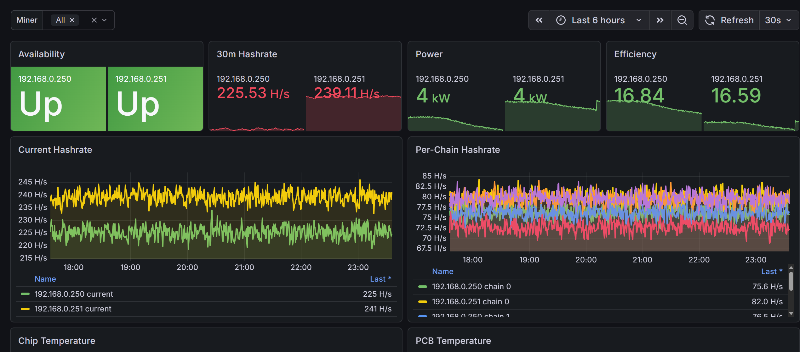

# Antminer Exporter

Unofficial Prometheus exporter for the modern Bitmain Antminer web API.

It was built for Antminer S21/S21+ firmware that exposes read-only JSON endpoints
under `/cgi-bin/*.cgi` with HTTP Digest authentication. It uses the same
blackbox-style pattern as `blackbox_exporter`: Prometheus owns target scheduling,
and the exporter receives the miner IP in `?target=...`.

## Features

- Scrapes modern Antminer HTTP Digest API.
- Supports `GET /metrics?target=<miner-ip>`.
- Keeps miner targets behind an allowlist.
- Exposes hashrate, power, efficiency, fan, ambient and chain temperature,
  chain hashrate, pool state, component health, and scrape health metrics.
- Does not export pool URLs, pool users, pool passwords, or miner configuration.
- Includes a Grafana dashboard for Antminer S21/S21+.

## Disclaimer

This project is unofficial and is not affiliated with, endorsed by, or
sponsored by Bitmain. ANTMINER is a trademark of its respective owner.

Grafana is a trademark of Grafana Labs. This project is not affiliated with,
endorsed by, or sponsored by Grafana Labs.

## Dashboard Preview



## Supported Miners

Tested with:

- Antminer S21+

Likely compatible with:

- Antminer S21, S21+, S21 Pro, and other modern Bitmain firmware that exposes
  `stats.cgi`, `summary.cgi`, `pools.cgi`, `get_system_info.cgi`, and
  `miner_type.cgi`.

Not currently supported:

- Old cgminer/bmminer TCP API only miners.
- Older Antminer firmware that uses different command names such as
  `miner_stats` or `miner_pools`.

Planned:

- Hydro-specific coolant and pump metrics. Generic hashrate, power, pool, and
  status metrics may already work if the web API shape matches.

## Metrics

Core metrics:

```text
antminer_up
antminer_scrape_duration_seconds
antminer_scrape_error
antminer_hashrate_5s_ghs
antminer_hashrate_30m_ghs
antminer_hashrate_avg_ghs
antminer_hashrate_ideal_ghs
antminer_power_watts
antminer_efficiency_j_per_th
antminer_ambient_temp_celsius
antminer_fan_rpm{fan="0"}
antminer_chain_hashrate_ghs{chain="0"}
antminer_chain_temp_chip_celsius{chain="0",sensor="0"}
antminer_chain_temp_pcb_celsius{chain="0",sensor="0"}
antminer_chain_asic_count{chain="0"}
antminer_status_ok{type="rate|network|fans|temp"}
antminer_pool_alive{pool="0"}
antminer_info{miner_type="...",firmware_type="...",ipaddress="..."}
```

The exporter intentionally does not set an `instance` label. Prometheus should
set `instance` through relabeling from the original target address.

## Quick Start

Create an env file:

```bash
cp .env.example .env
chmod 600 .env
```

Edit `.env`:

```env
ANTMINER_USER=root
ANTMINER_PASSWORD=your-password
ANTMINER_ALLOWED_TARGETS=192.168.0.250,192.168.0.251
ANTMINER_TIMEOUT_SECONDS=5
EXPORTER_LISTEN_ADDR=0.0.0.0
EXPORTER_LISTEN_PORT=9154
```

Run with Docker Compose:

```bash
docker compose up -d --build
```

Test manually:

```bash
curl 'http://127.0.0.1:9154/metrics?target=192.168.0.250'
curl 'http://127.0.0.1:9154/metrics?target=192.168.0.251'
```

## Prometheus

Use the blackbox-style relabeling pattern:

```yaml
scrape_configs:
  - job_name: antminer
    metrics_path: /metrics
    scrape_interval: 30s
    scrape_timeout: 10s
    static_configs:
      - targets:
          - 192.168.0.250
          - 192.168.0.251
    relabel_configs:
      - source_labels: [__address__]
        target_label: __param_target
      - source_labels: [__param_target]
        target_label: instance
      - source_labels: [__param_target]
        target_label: miner_ip
      - target_label: __address__
        replacement: antminer-exporter:9154
```

## Grafana

Import [`dashboards/antminer-s21.json`](dashboards/antminer-s21.json).

The dashboard expects:

- Prometheus datasource.
- `instance` label set to the miner IP by Prometheus relabeling.
- Metrics emitted by this exporter.

Panels included:

- Availability
- 30m Hashrate
- Power
- Efficiency
- Current Hashrate
- Per-Chain Hashrate
- Chip Temperature
- PCB Temperature
- Ambient Temperature
- Fan RPM
- Power And Efficiency
- Component Health
- Pool Alive
- Scrape Health

## Alerts

Alert examples are provided for both Grafana-managed alerting and native
Prometheus alerting rules:

- [`alerts/grafana-managed/antminer-alerts.yaml`](alerts/grafana-managed/antminer-alerts.yaml)
- [`alerts/prometheus/antminer.rules.yaml`](alerts/prometheus/antminer.rules.yaml)

The default rule set covers:

- Prometheus target down.
- Antminer API scrape failure.
- No alive mining pool.
- Low hashrate relative to ideal hashrate.
- Miner-reported component status failures.
- High and critical chip temperature.
- Stopped fan or fan RPM imbalance.
- Slow exporter scrape duration.

Grafana-managed rules use boolean PromQL comparisons plus Grafana threshold
expressions so alert instances evaluate to numeric `0` or `1`. Prometheus
alerting rules intentionally do not use `bool` comparisons, because Prometheus
fires alerts for every returned series regardless of whether the sample value is
`0`.

## API Endpoints Used

The exporter uses only read-only endpoints:

```text
/cgi-bin/summary.cgi
/cgi-bin/stats.cgi
/cgi-bin/pools.cgi
/cgi-bin/warning.cgi
/cgi-bin/get_system_info.cgi
/cgi-bin/miner_type.cgi
```

It intentionally does not call:

```text
/cgi-bin/get_miner_conf.cgi
/cgi-bin/set_miner_conf.cgi
/cgi-bin/set_network_conf.cgi
/cgi-bin/reboot.cgi
/cgi-bin/passwd.cgi
```

`get_miner_conf.cgi` may include pool credentials, so it is intentionally out
of scope for this exporter.

## Configuration

Environment variables:

| Variable | Default | Description |
| --- | --- | --- |
| `ANTMINER_USER` | `root` | Antminer web UI username. |
| `ANTMINER_PASSWORD` | `root` | Antminer web UI password. |
| `ANTMINER_ALLOWED_TARGETS` | empty | Comma-separated target allowlist. Empty means allow all. |
| `ANTMINER_TIMEOUT_SECONDS` | `5` | HTTP timeout per miner request. |
| `EXPORTER_LISTEN_ADDR` | `0.0.0.0` | Exporter listen address. |
| `EXPORTER_LISTEN_PORT` | `9154` | Exporter listen port. |

## Development

Run locally:

```bash
python -m venv .venv
. .venv/bin/activate
pip install -r requirements.txt
python -m antminer_exporter.app
```

If running from the repository checkout without installing as a package:

```bash
PYTHONPATH=src python -m antminer_exporter.app
```

Syntax check:

```bash
PYTHONPATH=src python -m py_compile src/antminer_exporter/app.py
```

## Notes

This project targets the modern Antminer web API. Older projects such as
`cgminer_exporter` target the cgminer/bmminer API, usually on TCP port `4028`.
Those are useful for older firmware, but they are not a drop-in replacement for
newer S21 web firmware.
